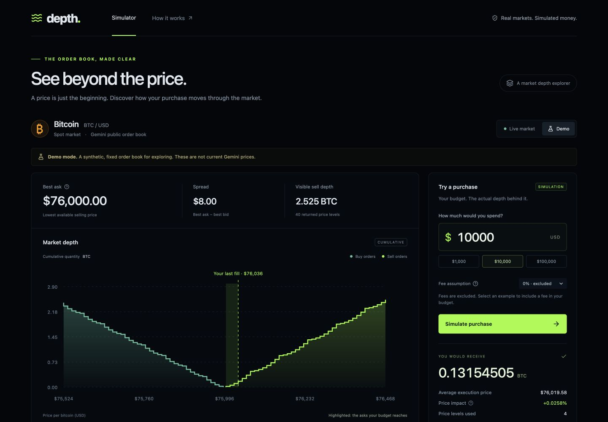
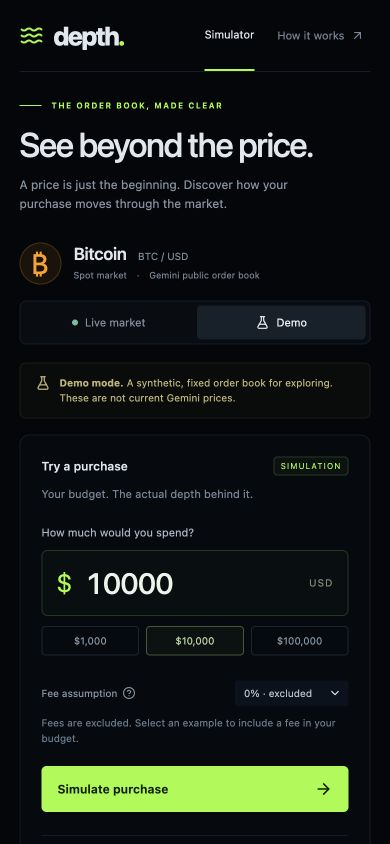

# depth

The price at the top of an order book only tells you what the first seller is
asking. It does not tell you how much bitcoin is available at that price, or
what a larger purchase would actually cost. Depth takes a dollar budget,
fills the cheapest sell orders first, and shows where the money goes: each
fill, the average price, and the difference from the best ask.

**[▶ Try it live](https://depth-ah2s.onrender.com)** ·
[Fixed demo](https://depth-ah2s.onrender.com/?demo=1) ·
[API docs](https://depth-ah2s.onrender.com/docs)

<p>
  <a href="https://depth-ah2s.onrender.com"></a>
  
  
  
  
  <a href="https://github.com/supreethch/depth/actions/workflows/ci.yml"></a>
</p>



<sub>The fixed, synthetic demo book with fees excluded. The best ask is $76,000,
but $10,000 reaches four price levels: the average comes to $76,019.58. Live mode
runs the same calculation against a fresh Gemini BTC/USD snapshot.</sub>



> The Render service can sleep when idle. The first visit may take about a minute
> to start it again. No login, exchange account, or API key is needed.

## Features

- **Follow a purchase through the book.** Enter a budget, compare the presets,
  and inspect the individual fills. The chart marks the last price reached and
  the order table highlights consumed asks.
- **Keep the calculation tied to what is on screen.** A snapshot ID connects
  the chart to the simulation. Refreshing fetches another snapshot; clicking
  simulate does not silently change the book underneath it.
- **Stop when the returned liquidity runs out.** In the demo, a $1 million
  budget fills the available 2.525 BTC and leaves $807,497.90 unspent. There are
  no invented orders to fill the remainder.
- **Account for rounding and fees explicitly.** Python `Decimal` handles the
  calculation in whole satoshis. Optional example fees fit inside the budget;
  fees are excluded by default.
- **Share market requests across visitors.** A server-side cache coalesces
  concurrent requests, refreshes at most once every ten seconds, and backs off
  after upstream failures. Aging snapshots are labeled and expire after two minutes.
- **A repeatable demo without live-market dependencies.** Synthetic data is
  visibly labeled and selected explicitly, including through the fixed-demo link.

## Stack

**Backend:** Python 3.12, FastAPI, Pydantic, HTTPX, standard-library `Decimal`.
**Frontend:** TypeScript, React 19, Vite, SVG depth chart, Lucide icons.
**Tests:** pytest, Playwright · **CI:** GitHub Actions · **Deployment:** Docker on Render.

No database, wallets, trading credentials, analytics, or runtime AI calls.

## How the calculation works

For each ask, in ascending price order, the engine finds the largest affordable
number of satoshis. Affordability includes the accumulated notional, the selected
fee, and rounding both cash amounts up to cents. This keeps the final debit
within the budget, even when a fee is smaller than one cent.

`average price = sum(fill price × fill quantity) / total bitcoin acquired`

`price impact = (average price / snapshot best ask − 1) × 100`

That impact measures walking the visible book. Real execution can also change
because of latency, cancellations, competing orders, or hidden liquidity. This
is a snapshot estimate, not a guaranteed quote. Up to 100 levels per side are
requested; the exchange's complete liquidity and trading minimums are not modeled.
Example fees and settlement rounding are simulator assumptions, not Gemini fee quotes.

## Docs

[Architecture](docs/architecture.md) · [HTTP API](docs/api.md) ·
[Verification](docs/verification.md) · [Running locally](docs/development.md) ·
[Deployment](docs/deployment.md) · [Demo walkthrough](docs/demo-guide.md)

## Running locally

Requires Python 3.12+ and Node.js 22+.

```sh
python3.12 -m venv .venv
source .venv/bin/activate
pip install -r requirements-dev.txt
pip install --no-deps -e .
npm ci --prefix frontend
uvicorn depth.app:app --host 127.0.0.1 --port 8000 --no-access-log
```

In another terminal, run `npm run dev --prefix frontend`, then open
[localhost:5173](http://localhost:5173). The frontend proxies API requests to
Python. Choose **Demo** to work without calling Gemini.

```sh
pytest -q
ruff check backend
npm run build --prefix frontend
cd frontend && npx playwright install chromium && npm run test:e2e
```

Tests cover cash conservation, liquidity bounds, fee rounding, concurrent cache
misses, backoff, expiry, and the browser purchase flow. CI also builds the Docker
image and checks its health endpoint, frontend, and demo API.

## Data and scope

Live data comes from [Gemini's public order-book API](https://developer.gemini.com/rest/market-data).
Gemini receives fixed market-data requests, never a visitor's budget. The
synthetic fixture ships with the code; live snapshots stay in a bounded memory
cache. There is no background polling when nobody is using the app.

The backend runs as one worker on one instance. Scaling it across replicas would
require shared snapshot storage and coordinated fetching. It models exchange
liquidity, not a blockchain, portfolio, or order-submission system.

Independent educational project. Not affiliated with Gemini; no real trades are placed.
