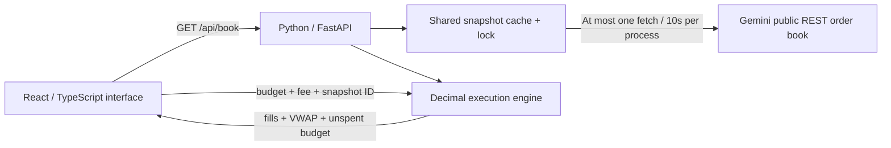

# Architecture and correctness

Depth is exchange-market software, not a blockchain implementation. It reads Gemini's unauthenticated BTC/USD order book and models a hypothetical immediate purchase against a frozen snapshot. No exchange account, API key, wallet, real order, or database exists in the application.

## One snapshot, one explanation

A live snapshot contains the server's receive time, a content/time-derived ID, and up to 100 price levels on each side. This is not an exchange-wide timestamp or guaranteed executable quote. Price levels are validated, duplicate prices combined, bids sorted descending, and asks ascending. Invalid, empty, crossed, or locked books are rejected.

The frontend refreshes explicitly, not continuously. This keeps the chart and result reproducible: `/api/simulate` receives the displayed snapshot ID rather than fetching a different book. Editing budget or fees hides the previous result. A source change invalidates in-flight responses. Snapshots become visibly aging after 10 seconds and cannot be simulated after 120 seconds. The server enforces that limit even if a client clock is wrong.

## Decimal execution

API money and quantities are decimal strings. Python `Decimal` uses 40 significant digits during execution. JavaScript numbers are used only for presentation and chart coordinates, never execution decisions.

For each ascending ask, the engine finds the maximum affordable integer number of satoshis using binary search. The affordability predicate is:

`ceil_cent(total_notional) + ceil_cent(total_notional × fee_bps / 10000) <= budget`

The default fee is explicitly zero/excluded. Optional fees are illustrative scenarios, not Gemini's actual fee schedule. Rounding notional and fees up separately is a documented conservative simulator convention. The execution price uses unrounded notional divided by total BTC. The price-impact percentage compares that price with the best ask of the same snapshot. It does not include fees and does not predict slippage from latency, cancellations, hidden liquidity, or competing orders.

The engine stops when it cannot afford one more satoshi or reaches the end of the returned asks. It never fabricates a fill beyond available depth. If all returned liquidity is consumed and another hypothetical satoshi at the final price would be affordable, the result is `partial_depth`, with the remainder explicitly unspent.

Time complexity: O(L log Q), where L is at most 100 price levels and Q is satoshis at one level. Memory: O(L) per result. These are algorithmic bounds, not measured latency claims.

## Cache and failure behavior

One process-wide lock coalesces simultaneous misses and failures. Successful snapshots are shared for 10 seconds. Failed requests back off for 10, 20, 40, then 60 seconds; numeric upstream `Retry-After` can extend that to 300 seconds. Fetches time out after five seconds. A failed refresh can serve the last good snapshot for at most 120 seconds with an explicit stale status. Beyond that the API returns 503. A bounded history retains 32 IDs; old IDs return 409.

Demo mode is a synthetic fixed fixture with a stable ID, `source: demo`, and no fabricated receive time. It is selected explicitly, never silently substituted for live data.

Run exactly one backend worker on one instance for the current cache design. Multiple workers/replicas would each maintain their own cache and snapshot IDs. Production horizontal scaling would require a shared store and distributed request coalescing; deploying this cache unchanged as independent serverless functions is not supported.

## Privacy and operational limits

No analytics, third-party fonts, cookies, local storage, user profiles, or visitor history. The budget is sent only to the app backend. Only fixed public book requests are sent to Gemini; budgets are not forwarded. The recommended server command disables access logs. Hosting providers still process connection metadata under their own policies; the app cannot promise the host collects nothing.

Other deliberate limits: BTC/USD only; no order-placement eligibility checks, minimum trading size enforcement, matching engine, portfolio tracking, blockchain, or prediction. This is an educational simulator with transparent assumptions.
